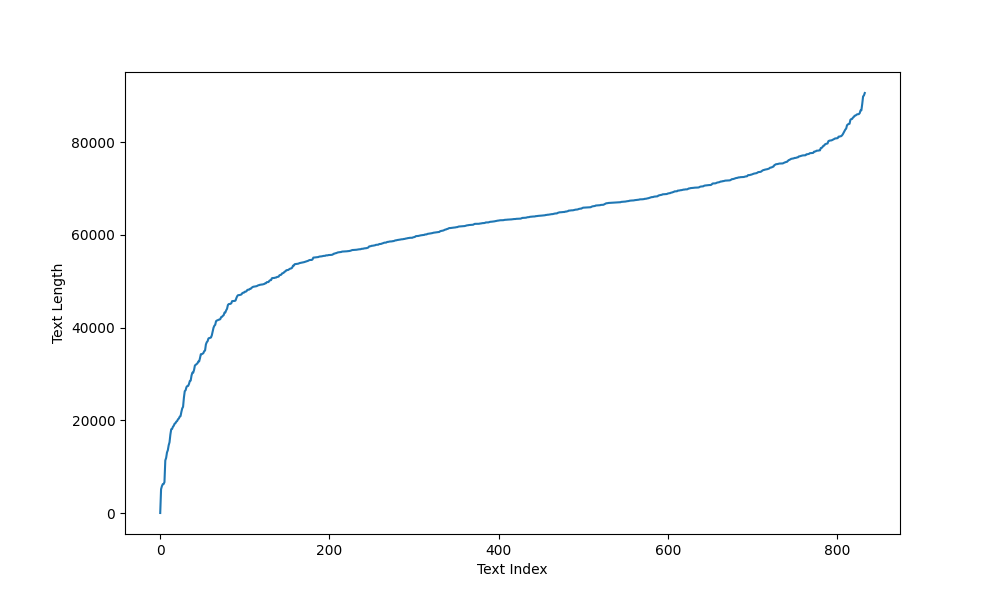

# 双模态情感识别模型

## 0. 数据格式

+ 输入：
    存储到本地 DATA_DIR 路径下面的音频文件和文本文件，路径的组织方式为：
    - DATA_DIR
        - audio
            - dress
                - file1.mp3
                - file2.mp3
                - ...
            - food
                - file1.mp3
                - file2.mp3
                - ...
            - make_up
                - file1.mp3
                - file2.mp3
                - ...
            - skin_care
                - file1.mp3
                - file2.mp3
                - ...
        - word_docments
            - dress
                - file1.docx
                - file2.docx
                - ...
            - food
                - file1.docx
                - file2.docx
                - ...
            - make_up
                - file1.docx
                - file2.docx
                - ...
            - skin_care
                - file1.docx
                - file2.docx
                - ...
    要特别注意的是，音频文件和文本文件的文件名是对应的，**即文件名相同**，只是后缀不同。处理的时候以文本文件的文件名为准，去查找对应的类别下面查找
    音频文件，如果找不到对应音频文件，则跳过该条数据
+ 输出：
    将文本文件和音频文件对应上，将对应上的文件存储到processed_data.pt文件中，将没有对应上的文件的文件名(xxx.docx)存储到not_in.txt文件中，输出文件条目 + 没有对应
    的文件条目 = 所有文本文件条目
    
    
        processed_data.pt 文件的格式为：
        [
            {
                'text': 'xxx', 
                'audio_embedding': dict,
                'category': 'xxx',
                'total_idx': int,
                'name': 'xxx',
                'category_idx': int
            },
            ...
        ]
       
        其中
            audio_embedding的格式为：
            {
                'embeddings': list,
                'label_emotion': list, 
            }

        not_in.txt文件的格式为：
        [
            'xxx',
            ...
        ]


## 1. 模型简介

本项目是一个双模态情感识别模型，用于识别文本和音频的情感。模型的输入是一段文本和一段音频，输出是文本和音频的情感标签。

一段文本和音频对应多个情感标签，我们将情感标签分为19类。

这是一个多标签分类问题。

## 2. 模型结构

模型的结构如下：

1. 文本模态：使用BERT模型提取文本特征

2. 音频模态：使用transformer模型提取音频特征

3. 融合模态：将文本特征和音频特征融合，使用全连接层进行分类

## 3. 数据集

数据集包含训练集、验证集和测试集，数据集的格式如下：

```json
{
    "text": "I am happy",
    "audio": "audio/1.wav",
    "label": [1,2,3]
}
```

训练集中的文本长度统计如下:



## 4. 模型训练

## 5. 模型预测

# 项目日志

## 

